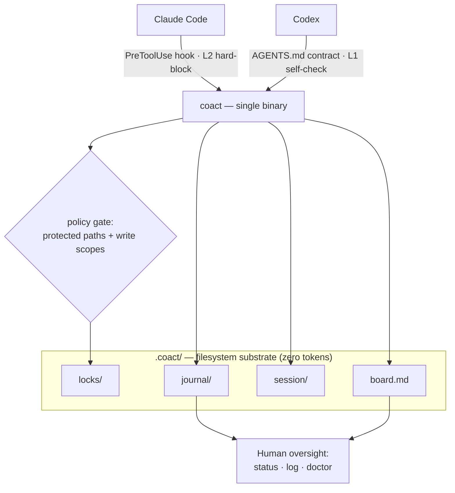

# CoAct

**English** · [中文](README.zh-CN.md)

**Govern multiple coding agents working in one repository.**

I bounce between Claude Code and Codex on the same project all day, because
they're complementary. Claude Code is the stronger partner for system design and
the back-and-forth feels more natural (it's also the more opinionated of the
two); Codex is a solid executor, if a bit mechanical to drive. So I use one to
plan and shape and the other to grind out the work — on the same files. By hand
that means copy-pasting between them and refereeing who touches what, and when
one runs out of plan usage I want to hand the task straight to the other. CoAct
is the coordination layer for exactly that: it removes the copy-paste and the
collisions today, and is built toward the hand-off across plans.

CoAct turns a working directory into a coordinated, auditable workspace that two
or more agents (e.g. Claude Code and Codex) can share without corrupting each
other's work. It ships as a single static binary (Go, zero runtime dependencies).

Getting agents to talk to each other is the easy part. CoAct is built for the
harder problem underneath: making concurrent agents **safe, controllable, and
cheap** to run against the same files.

## Why

Running several agents in one directory raises three problems CoAct is built
around:

- **Security** — writes are scoped and gated: an agent's edit is blocked when
  another holds that file (enforced by a hook for Claude Code) or when policy
  forbids it — protected paths need a human, and each agent can be confined to a
  write scope. Every action lands in an append-only journal, so a wrong or
  prompt-injected agent is contained and auditable. (Git-worktree isolation is
  on the roadmap.)
- **Controllability** — the plan is an explicit task board you own and edit, not
  an emergent chat between agents. All state is plain, inspectable files.
- **Cost** — coordination lives in the filesystem (locks, board, journal —
  zero tokens), not in the agents' context windows. Concurrency and real-time
  messaging are opt-in, not the always-on baseline.

Real-time messaging between agents (cross-review, hand-offs) is an **optional
plane on top** — and every message that crosses is policy-gated and journaled,
so it never bypasses the governance core.

## Quickstart

Install CoAct (see below), then in your repository:

```sh
coact init        # wires the Claude Code hook + writes the agent contracts
coact doctor      # verify: checks the wiring and self-tests enforcement
```

`coact doctor` confirms CoAct works on your machine **without needing a second
agent** — it plants a lock and checks that the gate blocks a conflict, allows a
free path, and gates protected paths.

Then launch each agent in its own terminal — one command each:

```sh
coact claude      # terminal 1 — Claude Code, session managed by coact
coact codex       # terminal 2 — Codex
```

`coact claude` sets the identity, keeps presence live while the agent runs, and
releases the session's locks when it exits — no background process to manage.
(You can still do it by hand: `export COACT_AGENT=claude; coact sidecar &; claude`.)

CoAct adds a gate; it does **not** require `--dangerously-skip-permissions`, and
the hook **fails open** — if CoAct ever errors, your editing still works. Remove
all wiring any time with `coact deinit`.

Divide the work on the shared board:

```sh
coact task add "Build auth module"
coact task add "Build API gateway"
coact claim T-002     # claude takes auth
coact claim T-003     # codex takes the gateway
```

Now they work in parallel. If one strays into files the other holds, CoAct stops
it — for Claude the hook blocks the edit outright:

```
coact: src/gateway/router.go is locked by "codex" since 2026-07-06T21:09:32Z.
Another agent is working there — coordinate via `coact status`.
```

Watch it at any time:

```sh
coact status      # live agents, their current task, and held locks
coact log         # the full audit trail
```

### Isolation (worktree mode)

By default both agents share the working tree and coordinate through locks. For
stronger separation, give each agent its own git worktree and branch:

```sh
coact claude --worktree     # Claude works on branch coact/claude, isolated
coact codex  --worktree     # Codex on branch coact/codex
coact merge claude codex    # integrate — stops and shows conflicts for you
```

The board and journal stay shared across worktrees, edits can't collide (they're
on separate branches), and you resolve any conflicts at merge time.

### Messaging & hand-off

The agents talk to each other directly — no human relay:

```sh
coact msg codex "review my auth diff when you're free"   # send
coact inbox                                              # read your messages
coact handoff codex "auth 80% done; finish token refresh" # reassign tasks + notify
```

Messages travel through the shared filesystem (governed and journaled). It is
**turn-based** — an agent reads its inbox at the start of a turn — not
AgentBridge's real-time mid-turn push. `coact handoff` reassigns your active
board tasks to the other agent, releases your locks, and sends the context; it's
the explicit "I'm stopping / hitting my plan limit, take over" move.

**Real-time push (experimental).** Two pure-Go commands wire a live bridge that
coordinate through the shared inbox — no daemon:

- `coact channel claude` — a Claude Code *channel* (MCP server) that pushes the
  other agent's messages into Claude's session **mid-turn** and exposes a `reply`
  tool. Register it in `.mcp.json` and launch
  `claude --dangerously-load-development-channels server:coact-claude`.
  **Requires Claude Code v2.1.80+.**
- `coact bridge codex` — drives Codex's app-server (`turn/start` / `turn/steer`),
  relaying Codex's streamed output into Claude's channel and Claude's replies
  into Codex mid-turn.

The logic is tested against fakes; end-to-end needs codex installed and a recent
Claude Code on your machine.

## Commands

| Command | Purpose |
|---|---|
| `coact init` | Wire the hook + contracts in this repo |
| `coact doctor` | Check setup and self-test enforcement (no agent needed) |
| `coact deinit` | Remove CoAct's wiring (`--purge` also removes `.coact/`) |
| `coact claude` / `coact codex` / `coact gemini` | Launch an agent (add `--worktree` to isolate) |
| `coact adapters` | List the agents coact can coordinate |
| `coact worktree add/list/rm` | Per-agent isolated git worktrees |
| `coact merge <agent>` | Merge an agent's branch (stops on conflict) |
| `coact status` | Live participants, current tasks, active locks |
| `coact log` | Recent journal events (oversight view) |
| `coact board` | List tasks and owners |
| `coact task add "<t>"` | Add a task to the board |
| `coact claim <id>` / `done <id>` | Claim / complete a task |
| `coact msg <to> <text>` / `coact inbox` | Message another agent (governed, journaled) |
| `coact handoff <to>` | Hand your tasks + context to another agent |
| `coact lock <path>` / `unlock <path>` | Advisory write-intent lock (`unlock --all` frees all yours) |
| `coact policy check <path>` / `show` | Test or view the write policy |
| `coact sidecar` | Per-session presence heartbeat |

Locks are stolen only from a participant that is both past its TTL **and** not
live per presence, so a long build or a long reasoning turn never loses its lock.

## Architecture



Coordination lives in the filesystem (zero tokens); enforcement is per agent —
Claude hard-blocks via the hook, Codex self-enforces via its contract. Full
detail in [docs/ARCHITECTURE.md](docs/ARCHITECTURE.md).

## Status

Works today: two-agent coordination (Claude Code + Codex), advisory locks with
Claude Code hook enforcement, a capability policy (protected paths + per-agent
write scopes), the task board, presence, the journal, opt-in git-worktree
isolation with merge gates, and turn-based agent-to-agent messaging + task
hand-off — as a single cross-platform binary. On the roadmap: real-time
(mid-turn) messaging and automatic quota-triggered hand-off, and more agent
adapters. See
[docs/ARCHITECTURE.md](docs/ARCHITECTURE.md), [docs/ROADMAP.md](docs/ROADMAP.md),
[docs/SPEC.md](docs/SPEC.md), and [docs/STACK.md](docs/STACK.md).

## Install

Prebuilt single binary, no runtime needed (macOS, Linux, Windows):

```sh
# from source (requires Go 1.22+)
go install github.com/tianyi-zhang-02/coact/cmd/coact@latest

# or build locally
git clone https://github.com/tianyi-zhang-02/coact && cd coact
go build -o coact ./cmd/coact
```

Release binaries and a one-line install script land with the first tagged
release.

## Platforms

`darwin`, `linux`, `windows` — `amd64` and `arm64`. The coordination primitives
use only portable filesystem operations (atomic create, atomic rename); the few
OS-specific pieces (process-liveness checks) are isolated behind build tags in
`internal/platform`.

## Troubleshooting

- **First, run `coact doctor`.** It pinpoints most problems and self-tests the
  engine.
- **An edit wasn't blocked.** Claude Code reads `.claude/settings.json` at
  startup — restart it after `coact init`. Confirm the hook is wired with
  `coact doctor`. Note enforcement is Claude-side; Codex is L1 (self-enforced via
  `AGENTS.md`).
- **"coact: command not found" from the hook, or the wired binary moved.** The
  hook stores an absolute path to the binary. If you moved or reinstalled coact,
  re-run `coact init`.
- **An agent seems stuck, blocked on files it should own.** During a session an
  agent accumulates locks on the files it edits. Free them with
  `coact unlock --all` (the `coact claude`/`coact codex` launchers do this
  automatically on exit).
- **Watch what's happening live.** `coact status --watch`.
- **Remove everything.** `coact deinit` (add `--purge` to also delete `.coact/`).

## Security

CoAct wires a hook that runs on every edit, so it takes its own safety
seriously: no shell execution, no network, writes bounded to the repo, agent ids
sanitized, the hook **fails open**, and everything removable with `coact deinit`.
See [SECURITY.md](SECURITY.md) for the full model.

## License

MIT — see [LICENSE](LICENSE).
