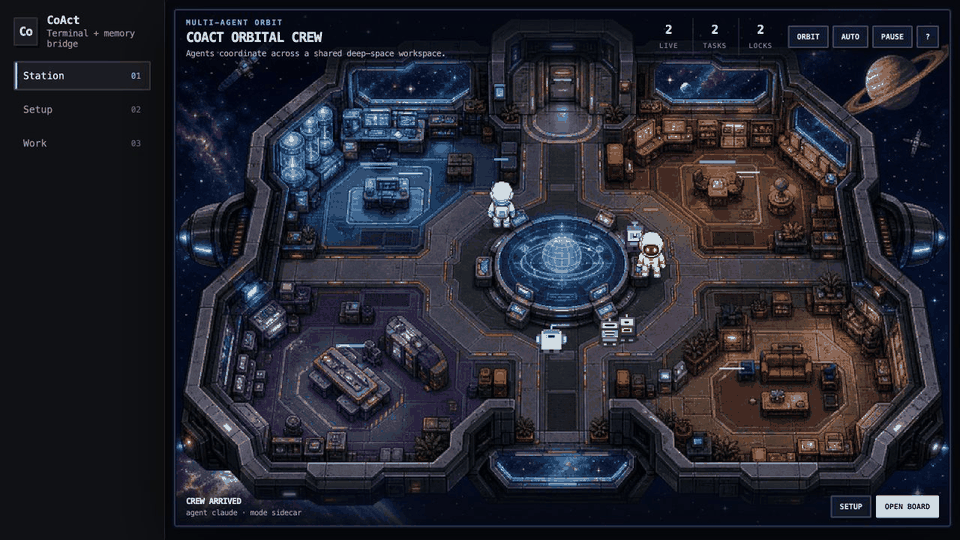

<div align="center">
  
  <h1>CoAct</h1>
  <p><strong>Coordinate Claude Code, Codex, and Antigravity in one repository—without replacing their native terminals.</strong></p>

  <p>
    <a href="https://github.com/tianyi-zhang-02/coact/releases/latest"></a>
    <a href="https://github.com/tianyi-zhang-02/coact/actions/workflows/ci.yml"></a>
    <a href="https://github.com/tianyi-zhang-02/coact/stargazers"></a>
    <a href="LICENSE"></a>
  </p>
  <p>
    
    
    <a href="README.md"></a>
    <a href="README.zh-CN.md"></a>
  </p>

  <p><strong>English</strong> · <a href="README.zh-CN.md">简体中文</a> · <a href="docs/FEATURES.md">Feature status</a> · <a href="SECURITY.md">Security</a></p>
</div>

<p align="center">
  
</p>
<p align="center"><em>Two native agent terminals. One shared plan, task board, safety layer, and audit trail.</em></p>

CoAct is a local coordination and safety layer for coding agents. It keeps each
agent in its familiar CLI while adding shared memory, structured planning, task
ownership, direct messages, write-intent locks, usage alerts, collaboration
reports, and an auditable journal.

> **CoAct coordinates agents; it is not another model provider, terminal, or
> autonomous coding agent.** Install and authenticate each agent CLI separately.

## Why CoAct?
| Without CoAct | With CoAct |
|---|---|
| Copy context between terminals | Shared project memory and inboxes |
| Agents choose overlapping work | Explicit tasks, owners, claims, and locks |
| Decisions disappear in chat history | Local planning files and an audit journal |
| Hard to compare teamwork | Usage alerts and evidence-labeled collaboration reports |
| Constantly inspect every terminal | One status command or an optional visual Station |

## Quick start

### 1. Install

Download a prebuilt binary from the [latest release](https://github.com/tianyi-zhang-02/coact/releases/latest),
or install with Go 1.22+:

```sh
go install github.com/tianyi-zhang-02/coact/cmd/coact@v1.0.0
```

Make sure the installed binary is on your `PATH`, then initialize a project:

```sh
cd your-project
coact init
coact doctor
```

### 2. Launch the agents you already use

Open one native terminal per agent. One agent works too; collaboration activates
when multiple live agents share the same initialized workspace.

```sh
# terminal 1
coact claude

# terminal 2
coact codex

# optional terminal 3 — launches the native `agy` CLI
coact antigravity
```

| Built-in launcher | Native CLI | Coordination enforcement |
|---|---|---|
| Claude Code | `claude` | Hook hard-blocks conflicting paths |
| OpenAI Codex | `codex` | Injected contract; worktrees available |
| Antigravity | `agy` | Injected contract; worktrees available |

### 3. Coordinate from any terminal

You do **not** need a separate management terminal:

```sh
coact @all "Read the project brief and propose a plan."
coact @codex "Review Claude's proposal before implementation."
coact inbox
coact board
coact status
```

The launcher sets `COACT_AGENT`, `COACT_BIN`, and `PATH`, so agents launched with
an absolute CoAct binary path can still run commands such as `coact inbox`.

`v1.0.0` is the first stable terminal-native coordination release.

## Optional visual Station <sup>Beta</sup>

Run `coact ui` for a loopback-only visual status view of live agents, tasks,
locks, messages, planning events, and audit activity. Agents still work in their
native terminals; Station does not capture terminal input or replace the CLI.
Animations can be disabled, and handoffs always require explicit human approval.
See [Feature status](docs/FEATURES.md) for current limitations.

## The normal workflow

### 1. Set shared preferences

`coact init` creates two human-controlled files:

- `.coact/team.md` — agent roles, planning participants, and final distributor
- `.coact/memory/project.md` — durable project facts and preferences

Do not put secrets in either file.

### 2. Plan together

```sh
coact plan --with codex,claude --lead codex "Refactor authentication safely"
coact plan status
```

Each agent receives a local inbox message and writes an independent proposal
under `.coact/runs/<run>/`. The distributor waits until proposals say
`Status: ready` and are unlocked. The lead writes structured tasks in
`final-plan.md`. Each task has a short Dashboard description plus the complete
prompt sent to its owner:

```md
## Execution tasks

- [codex] Implement the authentication change
  Prompt: Apply the approved design, add focused tests, and report validation.
- [claude] Review safety and documentation
  Prompt: Review the implementation for security regressions and update both READMEs.
- [unassigned] Run the final smoke test
```

```sh
coact plan submit --agent codex <run-id>
coact plan approve <run-id>                 # human safety gate
coact plan finalize --agent codex <run-id>
```

Human review is the default. `coact plan finalize` is blocked until the lead
submits and a human approves. `--approval auto` is an explicit dangerous mode
that lets the lead distribute without this approval; it does not wake agents or
replace their native CLI turns. Only the configured lead can finalize. CoAct locks the planning run,
rechecks every required proposal, serializes the board update, records task IDs
in `final-plan.md`, journals the decision, and notifies each participant. An
assigned task starts as `claimed`; its owner still runs `coact claim <id>` when
work actually begins. Delivery is turn-based by default: an idle agent reads the
message on its next turn. The optional real-time bridge is experimental.

After finishing a proposal, an agent can mark it safely without hand-editing
metadata:

```sh
coact plan ready <run-id>
```

### 3. Execute without stealing work

```sh
coact board
coact task add --prompt "Implement with focused tests" "Add rate limiting"
coact task show T-001            # explicit access to the full local prompt
coact task assign T-001 codex  # reserve without reporting work as started
coact claim T-001
coact lock internal/auth
# edit and test
coact unlock internal/auth
coact done T-001
```

The task lifecycle is `todo → claimed → doing → done`. A task cannot be marked
done until its owner has claimed and started it. Use `coact task unassign T-001`
before work starts or `coact task reopen T-001` after completion. The local UI
uses the same state machine and shows separate Open, All, and Done views.

Board mutations are serialized. Claude Code edits are hard-blocked by its hook when
a path conflicts; Codex and Antigravity follow an injected contract, so their shared-
tree enforcement is advisory. Use `coact <agent> --worktree` when stronger
physical isolation is important.

### 4. Message, hand off, and audit

```sh
coact @claude "Please review T-001."
coact handoff codex "Parser is complete; integration tests remain."
coact log -n 50
```

Messages only write local inbox files. They never execute shell commands.

## Usage alerts

CoAct does not scrape private provider accounts. A human, adapter, or agent can
record the quota data it already knows; CoAct evaluates it immediately and
alerts at 20% steps by default:

```sh
coact usage set --agent claude --model "Opus" --percent 42 --refresh-in 7d
coact usage set --agent codex --used 250000 --limit 1000000 --refresh "2026-07-17T00:00:00Z"
coact usage report
coact usage alerts
```

`coact usage report --watch` refreshes the local view. When a window is due,
the report asks for a new snapshot; CoAct does not poll a provider before then.
Crossed thresholds are journaled and sent to local workmate/human inboxes.

## Collaboration reports

Agents can rate each other after a run. Audit-derived facts and subjective peer
scores remain clearly separated:

```sh
coact eval rate --peer claude --model "Opus" --score 4 \
  --code-quality 5 --responsiveness 3 --note "Strong review; response was slow."
coact eval report run-20260710-120000
```

The report summarizes task completion, messages, lock issues, merge conflicts,
observed response delay, discrepancy handling, and peer-rated code quality.
`--watch` provides a continuously refreshed terminal report. Reports are local
decision support—not an objective model benchmark.

## Chinese expression diagnostics

The default-on, model-independent Chinese expression foundation detects Chinese
and mixed Chinese/English output, protects code, URLs, paths, and tables, and
falls back to raw text if validation fails:

```sh
echo '这个 feature 的 goal 是共享 memory，同时运行 `coact inbox`。' | coact zh check --diagnostics
echo '这是一个测试。' | coact zh check --off
```

The current release exposes detection/protection diagnostics and a Go adapter;
it does not automatically call a polishing model inside provider output.

## What is ready?

See [Feature status](docs/FEATURES.md) for the reviewed matrix. In short:

- **Ready:** initialization, native launchers, shared memory, planning files,
  board ownership, inbox, locks/policy, audit log, worktrees, local usage alerts,
  collaboration reports, and Chinese diagnostics.
- **Experimental:** real-time Claude↔Codex bridge, local UI, and managed updates.
- **Not included:** autonomous agent wake-up, provider-account scraping, embedded
  terminals, automatic model switching, or a full autopilot.

## Safety model

- Coordination data stays under `.coact/`; sensitive runtime data is gitignored.
- Agent/run identifiers are path-safe; state writes are atomic and serialized
  where concurrent mutation matters.
- `.coact/config.json`, board internals, locks, inboxes, journals, terminal logs,
  usage snapshots, and evaluations are protected from direct agent rewrites.
- `coact doctor` checks wiring and runs an enforcement self-test.
- Hooks fail open for availability: CoAct is a guardrail, not a process sandbox.
- `coact update` is opt-in, HTTPS-only, and SHA-256 verified, but releases are
  not cryptographically signed yet.

Read [SECURITY.md](SECURITY.md) before relying on CoAct for high-assurance work.

## Command map

| Need | Command |
|---|---|
| Set up or verify | `coact init`, `coact doctor`, `coact deinit` |
| Launch agents | `coact claude`, `coact codex`, `coact antigravity` |
| Plan | `coact plan`, `coact plan ready`, `coact plan submit/approve/status/finalize` |
| Own work | `coact board`, `task add/show/assign/unassign/reopen`, `claim`, `done` |
| Coordinate | `coact @agent`, `@all`, `inbox`, `handoff` |
| Prevent overlap | `coact lock`, `unlock`, `policy`, `worktree`, `merge` |
| Observe | `coact`, `status`, `log` |
| Track quota | `coact usage set`, `report`, `alerts` |
| Review teamwork | `coact eval rate`, `report` |
| Diagnose Chinese output | `coact zh check` |
| Manage versions | `coact versions`, `update`, `switch` |

Run `coact help` for all flags. `coact ui`, `channel`, and `bridge` remain
optional experimental commands.

## Install from source

```sh
git clone https://github.com/tianyi-zhang-02/coact
cd coact
go build -o coact ./cmd/coact
```

MIT — see [LICENSE](LICENSE).
