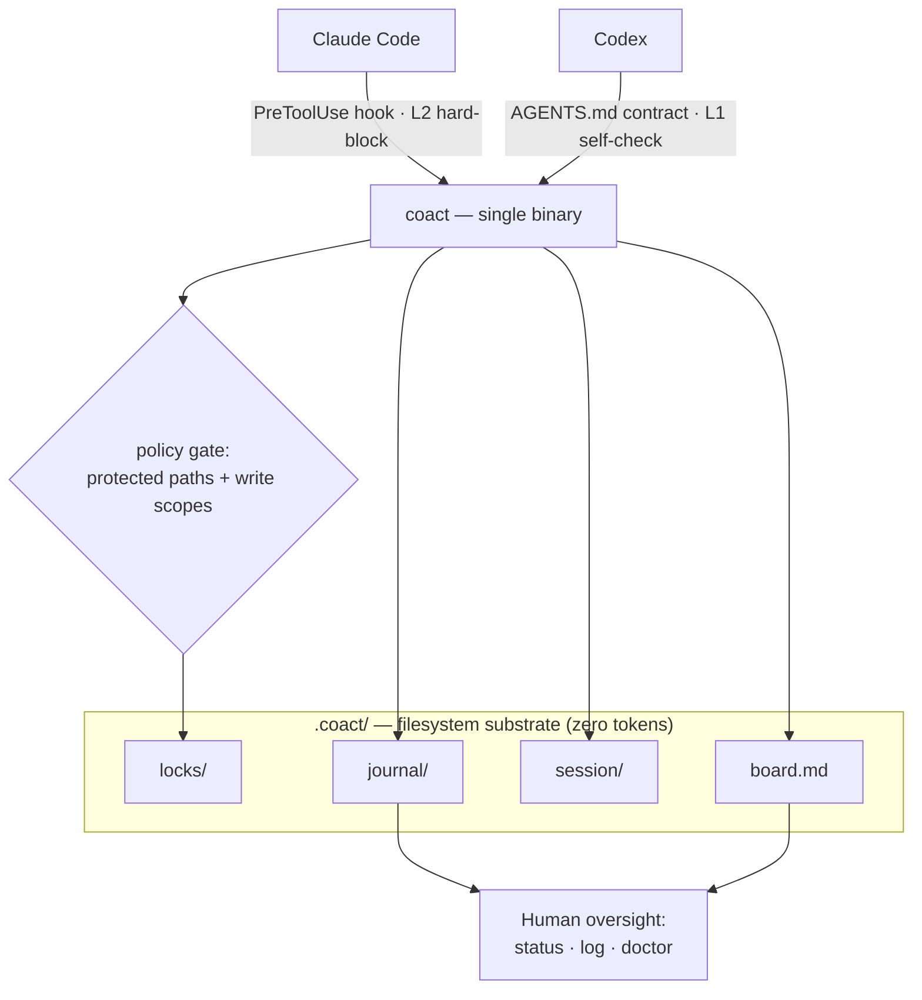

# CoAct

**Govern multiple coding agents working in one repository.**

<details>
<summary><b>🌏 中文说明 — 点击展开 / click to expand</b></summary>

<br>

**让多个编码 agent 在同一个仓库里协同工作。**

我整天都在同一个项目上、在 Claude Code 和 Codex 之间反复横跳,因为它俩是互补的。
Claude Code 更擅长系统设计,整体交互也更自然(当然它也是更有"脾气"的那个);Codex
执行得扎实,只是用起来有点呆。所以我常常用一个来规划和梳理、用另一个来把活干出来
——都在同一批文件上。手动这么搞就得在两边复制粘贴、还得盯着谁能动哪些文件;而当其中
一个用满了套餐额度,我又想把任务直接交给另一个。CoAct 就是为此而生的协同层:它现在
解决了复制粘贴和互相踩踏,并正朝着"跨套餐交接"演进。

CoAct 把一个工作目录变成一个受协调、可审计的工作区,让两个或更多 agent(比如
Claude Code 和 Codex)在同一份文件上工作而互不破坏。它是一个独立的静态二进制
(Go 编写,零运行时依赖)。

**为什么**

- **安全** —— 当另一个 agent 正持有某个文件时,这个 agent 的编辑会被拦下(对
  Claude Code 通过 hook 强制执行),策略禁止时也会被拦下(受保护路径需要人来把关,
  每个 agent 还能被限定在写入范围内)。所有动作都写进只追加的 journal,因此出错或
  被注入的 agent 是被隔离且可追溯的。
- **可控** —— 计划是一块你自己拥有并编辑的任务板,而不是 agent 之间自发的聊天;
  所有状态都是纯文本、可直接查看的文件。
- **低成本** —— 协调发生在文件系统里(锁、任务板、journal——零 token),而不是在
  agent 的上下文窗口里;并发和实时消息是可选的。

**快速开始**

```sh
coact init        # 接入 Claude Code 的 hook,并写入 agent 契约
coact doctor      # 验证:检查接线,并对强制执行做自检(不需要第二个 agent)
```

然后每个 agent 一条命令启动(各自的终端):

```sh
coact claude      # 终端 1 —— Claude Code,会话由 coact 托管
coact codex       # 终端 2 —— Codex
```

在共享任务板上分工,并行工作;如果一个跑去动另一个正持有的文件,CoAct 会拦住它
(对 Claude,hook 直接拦下这次编辑)。用 `coact status` / `coact log` 随时查看。

CoAct 只是加了一道 gate;它**不需要** `--dangerously-skip-permissions`,而且 hook
是**失败开放**的——万一 CoAct 出错,你照样能编辑。任何时候都能用 `coact deinit` 移除。

**隔离(worktree 模式)**

想要更强的隔离,就给每个 agent 各自一个 git worktree 和分支:

```sh
coact claude --worktree     # Claude 在 coact/claude 分支上隔离工作
coact codex  --worktree     # Codex 在 coact/codex 分支上
coact merge claude codex    # 集成——遇到冲突会停下来并把冲突列给你看
```

任务板和 journal 在各 worktree 之间保持共享;因为在不同分支上,编辑不会互相踩踏,
冲突留到合并时由你来解决。

**现状**

现在可用:两个 agent(Claude Code + Codex)的协同、带 Claude Code hook 强制执行的
写入意图锁、能力策略(受保护路径 + 每个 agent 的写入范围)、任务板、presence、
journal,以及可选的带合并闸门的 git worktree 隔离——全部装在一个跨平台的二进制里。
路线图上:更多 agent 适配器、以及可选的消息平面。

**安装**

```sh
go install github.com/tianyi-zhang-02/coact/cmd/coact@latest
```

**安全**

CoAct 会接入一个在每次编辑时都运行的 hook,因此它很在意自身的安全:不执行 shell、
不联网、写入被限定在仓库内、agent 标识会被净化、hook **失败开放**,一切都能用
`coact deinit` 移除。完整安全模型见 [SECURITY.md](SECURITY.md)。

架构图与完整细节(命令、协议、平台、排障)见下方英文正文与
[docs/ARCHITECTURE.md](docs/ARCHITECTURE.md)。

</details>

I bounce between Claude Code and Codex on the same project all day, because
they're complementary. Claude Code is the stronger partner for system design and
the back-and-forth feels more natural (it's also the more opinionated of the
two); Codex is a solid executor, if a bit mechanical to drive. So I use one to
plan and shape and the other to grind out the work — on the same files. By hand
that means copy-pasting between them and refereeing who touches what, and when
one runs out of plan usage I want to hand the task straight to the other. CoAct
is the coordination layer for exactly that: it removes the copy-paste and the
collisions today, and is built toward the hand-off across plans.

CoAct turns a working directory into a coordinated, auditable workspace that two
or more agents (e.g. Claude Code and Codex) can share without corrupting each
other's work. It ships as a single static binary (Go, zero runtime dependencies).

Getting agents to talk to each other is the easy part. CoAct is built for the
harder problem underneath: making concurrent agents **safe, controllable, and
cheap** to run against the same files.

## Why

Running several agents in one directory raises three problems CoAct is built
around:

- **Security** — writes are scoped and gated: an agent's edit is blocked when
  another holds that file (enforced by a hook for Claude Code) or when policy
  forbids it — protected paths need a human, and each agent can be confined to a
  write scope. Every action lands in an append-only journal, so a wrong or
  prompt-injected agent is contained and auditable. (Git-worktree isolation is
  on the roadmap.)
- **Controllability** — the plan is an explicit task board you own and edit, not
  an emergent chat between agents. All state is plain, inspectable files.
- **Cost** — coordination lives in the filesystem (locks, board, journal —
  zero tokens), not in the agents' context windows. Concurrency and real-time
  messaging are opt-in, not the always-on baseline.

Real-time messaging between agents (cross-review, hand-offs) is an **optional
plane on top** — and every message that crosses is policy-gated and journaled,
so it never bypasses the governance core.

## Quickstart

Install CoAct (see below), then in your repository:

```sh
coact init        # wires the Claude Code hook + writes the agent contracts
coact doctor      # verify: checks the wiring and self-tests enforcement
```

`coact doctor` confirms CoAct works on your machine **without needing a second
agent** — it plants a lock and checks that the gate blocks a conflict, allows a
free path, and gates protected paths.

Then launch each agent in its own terminal — one command each:

```sh
coact claude      # terminal 1 — Claude Code, session managed by coact
coact codex       # terminal 2 — Codex
```

`coact claude` sets the identity, keeps presence live while the agent runs, and
releases the session's locks when it exits — no background process to manage.
(You can still do it by hand: `export COACT_AGENT=claude; coact sidecar &; claude`.)

CoAct adds a gate; it does **not** require `--dangerously-skip-permissions`, and
the hook **fails open** — if CoAct ever errors, your editing still works. Remove
all wiring any time with `coact deinit`.

Divide the work on the shared board:

```sh
coact task add "Build auth module"
coact task add "Build API gateway"
coact claim T-002     # claude takes auth
coact claim T-003     # codex takes the gateway
```

Now they work in parallel. If one strays into files the other holds, CoAct stops
it — for Claude the hook blocks the edit outright:

```
coact: src/gateway/router.go is locked by "codex" since 2026-07-06T21:09:32Z.
Another agent is working there — coordinate via `coact status`.
```

Watch it at any time:

```sh
coact status      # live agents, their current task, and held locks
coact log         # the full audit trail
```

### Isolation (worktree mode)

By default both agents share the working tree and coordinate through locks. For
stronger separation, give each agent its own git worktree and branch:

```sh
coact claude --worktree     # Claude works on branch coact/claude, isolated
coact codex  --worktree     # Codex on branch coact/codex
coact merge claude codex    # integrate — stops and shows conflicts for you
```

The board and journal stay shared across worktrees, edits can't collide (they're
on separate branches), and you resolve any conflicts at merge time.

## Commands

| Command | Purpose |
|---|---|
| `coact init` | Wire the hook + contracts in this repo |
| `coact doctor` | Check setup and self-test enforcement (no agent needed) |
| `coact deinit` | Remove CoAct's wiring (`--purge` also removes `.coact/`) |
| `coact claude` / `coact codex` | Launch an agent (add `--worktree` to isolate) |
| `coact worktree add/list/rm` | Per-agent isolated git worktrees |
| `coact merge <agent>` | Merge an agent's branch (stops on conflict) |
| `coact status` | Live participants, current tasks, active locks |
| `coact log` | Recent journal events (oversight view) |
| `coact board` | List tasks and owners |
| `coact task add "<t>"` | Add a task to the board |
| `coact claim <id>` / `done <id>` | Claim / complete a task |
| `coact lock <path>` / `unlock <path>` | Advisory write-intent lock (`unlock --all` frees all yours) |
| `coact policy check <path>` / `show` | Test or view the write policy |
| `coact sidecar` | Per-session presence heartbeat |

Locks are stolen only from a participant that is both past its TTL **and** not
live per presence, so a long build or a long reasoning turn never loses its lock.

## Architecture



Coordination lives in the filesystem (zero tokens); enforcement is per agent —
Claude hard-blocks via the hook, Codex self-enforces via its contract. Full
detail in [docs/ARCHITECTURE.md](docs/ARCHITECTURE.md).

## Status

Works today: two-agent coordination (Claude Code + Codex), advisory locks with
Claude Code hook enforcement, a capability policy (protected paths + per-agent
write scopes), the task board, presence, the journal, and opt-in git-worktree
isolation with merge gates — as a single cross-platform binary. On the roadmap:
more agent adapters and the optional messaging plane. See
[docs/ARCHITECTURE.md](docs/ARCHITECTURE.md), [docs/ROADMAP.md](docs/ROADMAP.md),
[docs/SPEC.md](docs/SPEC.md), and [docs/STACK.md](docs/STACK.md).

## Install

Prebuilt single binary, no runtime needed (macOS, Linux, Windows):

```sh
# from source (requires Go 1.22+)
go install github.com/tianyi-zhang-02/coact/cmd/coact@latest

# or build locally
git clone https://github.com/tianyi-zhang-02/coact && cd coact
go build -o coact ./cmd/coact
```

Release binaries and a one-line install script land with the first tagged
release.

## Platforms

`darwin`, `linux`, `windows` — `amd64` and `arm64`. The coordination primitives
use only portable filesystem operations (atomic create, atomic rename); the few
OS-specific pieces (process-liveness checks) are isolated behind build tags in
`internal/platform`.

## Troubleshooting

- **First, run `coact doctor`.** It pinpoints most problems and self-tests the
  engine.
- **An edit wasn't blocked.** Claude Code reads `.claude/settings.json` at
  startup — restart it after `coact init`. Confirm the hook is wired with
  `coact doctor`. Note enforcement is Claude-side; Codex is L1 (self-enforced via
  `AGENTS.md`).
- **"coact: command not found" from the hook, or the wired binary moved.** The
  hook stores an absolute path to the binary. If you moved or reinstalled coact,
  re-run `coact init`.
- **An agent seems stuck, blocked on files it should own.** During a session an
  agent accumulates locks on the files it edits. Free them with
  `coact unlock --all` (the `coact claude`/`coact codex` launchers do this
  automatically on exit).
- **Watch what's happening live.** `coact status --watch`.
- **Remove everything.** `coact deinit` (add `--purge` to also delete `.coact/`).

## Security

CoAct wires a hook that runs on every edit, so it takes its own safety
seriously: no shell execution, no network, writes bounded to the repo, agent ids
sanitized, the hook **fails open**, and everything removable with `coact deinit`.
See [SECURITY.md](SECURITY.md) for the full model.

## License

MIT — see [LICENSE](LICENSE).
