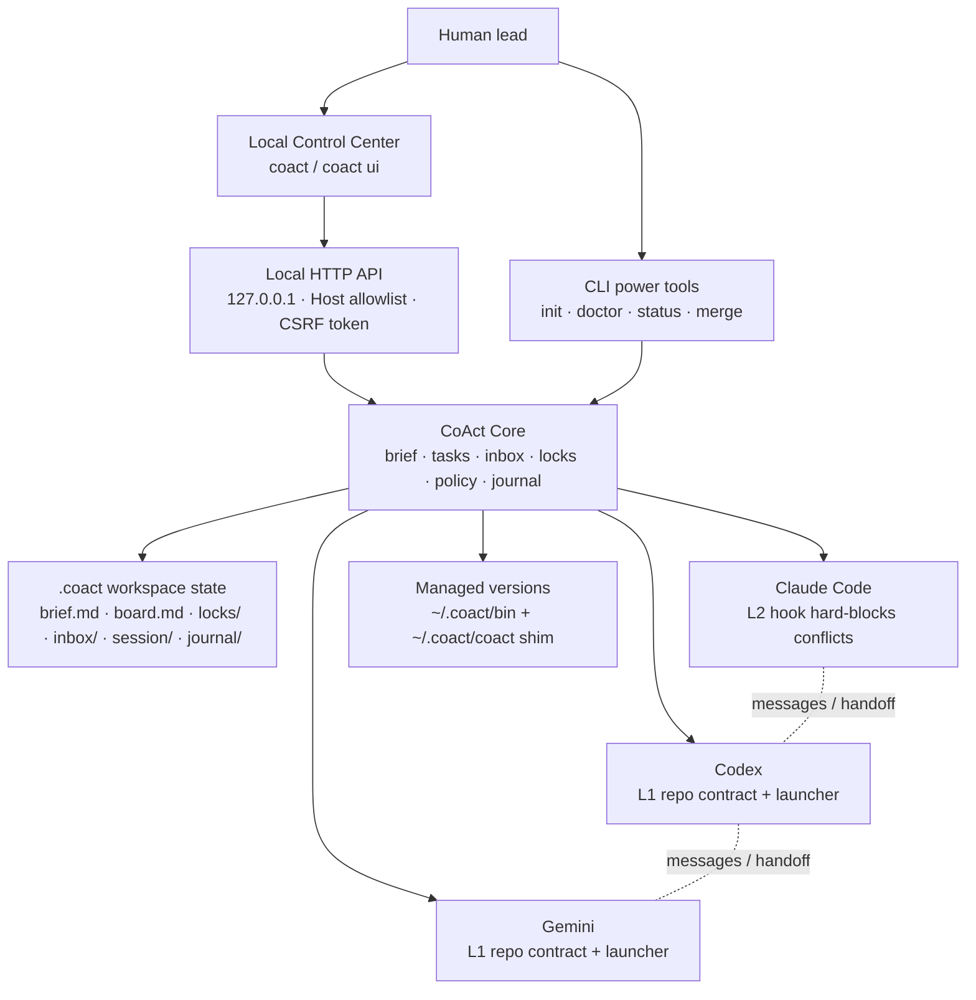

# CoAct

**English** · [中文](README.zh-CN.md)

**A local control center for multiple coding agents working in one repository.**

CoAct lets you use Claude Code, Codex, Gemini, or other coding agents on the
same project without manually copying context between them or guessing who owns
which files. It gives you a local UI, a shared brief, tasks, messages, locks,
policy checks, an audit log, and managed updates — all in one static Go binary.

CoAct is not a model provider and does not replace your agents. It coordinates
the tools you already use.

## Quickstart

Install CoAct, then run this inside a repo:

```sh
coact
```

`coact` opens the local control center at `127.0.0.1`. From the UI you can:

1. Initialize the repo.
2. Write a project brief for all agents.
3. Create and assign tasks.
4. Copy launch commands for Claude Code, Codex, or Gemini.
5. Watch agents, locks, messages, and the activity log update live.

Prefer terminal-only usage? The CLI still works:

```sh
coact init
coact doctor
coact claude      # terminal 1
coact codex       # terminal 2
```

`coact doctor` validates the wiring and runs a local enforcement self-test. It
does not require a second agent.

## Typical workflow

### 1. Plan in the control center

Use `coact` to write the brief and task list. The shared state lives in
`.coact/`, so every agent sees the same board without burning context tokens.

### 2. Launch agents

```sh
coact claude
coact codex
coact gemini
```

Each launcher sets the agent identity, keeps presence alive, and releases that
session's locks when it exits.

### 3. Divide work

Use the UI or CLI:

```sh
coact task add "Build auth module"
coact claim T-001
coact done T-001
```

### 4. Avoid file collisions

CoAct tracks write-intent locks and policy:

- Claude Code gets L2 enforcement through a `PreToolUse` hook.
- Codex and Gemini get L1 enforcement through their repo contract files.
- Protected paths and per-agent write scopes are policy-gated.
- Every significant action is journaled.

If another agent owns a path, CoAct tells the agent to stop and coordinate
instead of silently overwriting work.

### 5. Message or hand off

```sh
coact msg codex "Please review the auth diff."
coact inbox
coact handoff codex "Auth is mostly done; finish token refresh."
```

Messages are local, governed, and journaled. The default path is turn-based;
real-time push remains experimental.

### 6. Isolate with worktrees when needed

```sh
coact claude --worktree
coact codex --worktree
coact merge claude codex
```

Worktree mode gives each agent its own branch while keeping the board and
journal shared.

## Design



The UI is the cockpit. The core is the governance layer. The agents still run as
their normal CLIs.

## Commands

| Command | Purpose |
|---|---|
| `coact` / `coact ui` | Open the local control center |
| `coact init` / `doctor` / `deinit` | Set up, verify, or remove CoAct wiring |
| `coact claude` / `codex` / `gemini` | Launch managed agent sessions |
| `coact board` / `task add` / `claim` / `done` | Manage shared tasks |
| `coact status` / `log` | Inspect participants, locks, and audit trail |
| `coact msg` / `inbox` / `handoff` | Communicate between agents |
| `coact lock` / `unlock` / `policy` | Manage write intent and policy checks |
| `coact worktree` / `merge` | Isolate agents on branches and integrate work |
| `coact versions` / `update` / `switch` | Manage binaries under `~/.coact` |
| `coact channel` / `bridge` | Experimental real-time agent bridge |

Run `coact help` for the full command list.

## Install

From source:

```sh
go install github.com/tianyi-zhang-02/coact/cmd/coact@latest
```

Or build locally:

```sh
git clone https://github.com/tianyi-zhang-02/coact
cd coact
go build -o coact ./cmd/coact
```

Managed updates install side-by-side into `~/.coact/bin` and only switch the
managed shim:

```sh
coact update --channel stable
coact versions
coact switch v0.1.0
```

## Safety

- The UI binds locally and also enforces a Host allowlist plus a per-run CSRF
  token.
- The UI does not expose an arbitrary shell execution API.
- Hooks fail open: if CoAct errors, it does not brick your editor.
- Runtime state stays in `.coact/`; managed binaries stay in `~/.coact`.
- `coact update` is opt-in, uses HTTPS, and verifies SHA-256 checksums.

See [SECURITY.md](SECURITY.md) for the full model.

## Status

Available now: local control center, task board, brief, locks, policy, journal,
Claude hook enforcement, Codex/Gemini contracts, turn-based messaging, handoff,
worktree mode, merge gates, and managed updates.

Next: embedded live terminals, UI model selection, deeper real-time control,
autopilot, and release signing. See [docs/ROADMAP.md](docs/ROADMAP.md).

## License

MIT — see [LICENSE](LICENSE).
