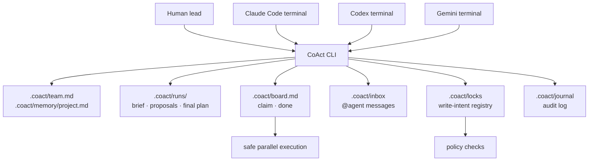

# CoAct

**English** · [中文](README.zh-CN.md)

**Terminal-native coordination for multiple coding agents in one repository.**

CoAct lets Claude Code, Codex, Gemini, and other coding agents work in the same
project without copying context by hand or overwriting each other. Agents keep
using their native terminals. CoAct provides the shared coordination layer:
team policy, project memory, planning runs, task ownership, inbox messages,
write-intent locks, policy checks, and an audit journal.

CoAct is not a model provider and does not replace your agent CLIs.

## Quickstart

```sh
coact init
coact doctor
coact claude      # terminal 1
coact codex       # terminal 2
```

Then coordinate from any terminal:

```sh
coact @codex "Please review Claude's proposal."
coact @claude "Please check the UX copy."
coact @all "Planning starts now. Read the run brief."
coact inbox
```

Start a structured planning phase:

```sh
coact plan --with codex,claude --distributor codex "Build the auth module safely"
```

CoAct creates `.coact/runs/<run>/`, asks each agent to write a proposal, and
asks the configured final distributor to write the final plan and create tasks.

## Workflow

### 1. Define team policy

`coact init` creates `.coact/team.md`. Use it to define preferences such as:

- who is the `final_task_distributor`
- which agents participate in planning
- what Claude/Codex/Gemini should usually own
- what every agent must read before starting

Local long-lived context goes in `.coact/memory/project.md`.

### 2. Run native terminals

Agents stay in their own CLIs:

```sh
coact claude
coact codex
coact gemini
```

The launchers set `COACT_AGENT`, keep presence alive, and release session locks
on exit. You can also run the agent CLIs manually as long as they follow the
repo contract files.

### 3. Plan together

```sh
coact plan --with codex,claude --distributor codex "Refactor the CLI"
coact plan status
```

Planning files live under `.coact/runs/<run>/`:

- `brief.md` — human/task brief
- `proposals/<agent>.md` — each agent's independent plan
- `notes/<agent>.md` — optional second-pass notes after reading peers
- `final-plan.md` — distributor's execution decision

### 4. Execute without collisions

```sh
coact board
coact task add "Add @agent inbox syntax"
coact claim T-001
coact lock internal/cli
coact done T-001
```

CoAct serializes board mutations so agents cannot claim the same task at once.
Write-intent locks prevent overlapping edits. Claude Code receives L2 hook
enforcement; Codex and Gemini receive L1 contract enforcement.

### 5. Message and hand off

```sh
coact @claude "Please review T-001 before I mark it done."
coact inbox
coact handoff codex "I finished parser changes; tests still need work."
```

Messages are local filesystem inbox entries. They are not shell execution, and
they are journaled.

## Design



The default product is terminal-native. `coact ui` remains optional and
experimental; it is not required for the main workflow.

## Commands

| Command | Purpose |
|---|---|
| `coact` | Show terminal workspace summary |
| `coact init` / `doctor` / `deinit` | Set up, verify, or remove CoAct wiring |
| `coact claude` / `codex` / `gemini` | Launch managed native agent sessions |
| `coact @agent "..."` / `@all "..."` | Send local inbox messages |
| `coact plan "..."` / `plan status` | Create or inspect a planning run |
| `coact board` / `task add` / `claim` / `done` | Manage shared tasks |
| `coact status` / `log` | Inspect participants, locks, and audit trail |
| `coact inbox` / `handoff` | Read messages or transfer context/tasks |
| `coact lock` / `unlock` / `policy` | Manage write intent and policy checks |
| `coact worktree` / `merge` | Isolate agents on branches and integrate work |
| `coact versions` / `update` / `switch` | Manage binaries under `~/.coact` |
| `coact ui` | Optional experimental local UI |

Run `coact help` for the full command list.

## Safety

- `@agent` and inbox messages only write local files; they do not execute shell.
- Board mutations are serialized, so two agents cannot claim the same task at once.
- Write-intent locks prevent accidental overlapping edits.
- Runtime/sensitive coordination state is gitignored: inbox, journal, locks,
  sessions, terminal logs, planning runs, and local memory.
- Hooks fail open: if CoAct errors, it does not brick your editor.
- `coact update` is opt-in, uses HTTPS, and verifies SHA-256 checksums.

See [SECURITY.md](SECURITY.md) for the full model.

## Install

```sh
go install github.com/tianyi-zhang-02/coact/cmd/coact@latest
```

Or build locally:

```sh
git clone https://github.com/tianyi-zhang-02/coact
cd coact
go build -o coact ./cmd/coact
```

## License

MIT — see [LICENSE](LICENSE).
