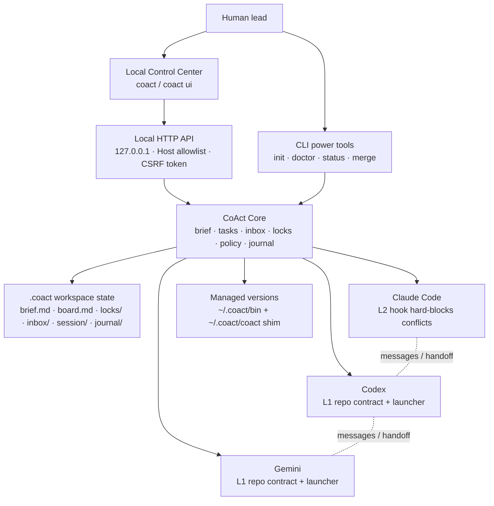

# CoAct

[English](README.md) · **中文**

**给多个编码 agent 共用同一个仓库的本地控制中心。**

CoAct 让你可以在同一个项目里同时使用 Claude Code、Codex、Gemini 或其他编码
agent，而不用来回复制上下文，也不用猜谁能改哪些文件。它提供本地 UI、共享 brief、
任务板、消息、锁、策略检查、审计日志和版本管理，并打包成一个静态 Go 二进制。

CoAct 不是模型提供方，也不替代 Claude/Codex/Gemini。它负责协调你已经在用的工具。

## 快速开始

安装 CoAct 后，在仓库里运行:

```sh
coact
```

`coact` 会打开只监听 `127.0.0.1` 的本地控制台。你可以在 UI 里完成:

1. 初始化仓库。
2. 写给所有 agent 共享的项目 brief。
3. 创建和分配任务。
4. 复制 Claude Code、Codex、Gemini 的启动命令。
5. 实时查看 agent、锁、消息和活动日志。

如果更喜欢纯终端，CLI 仍然可用:

```sh
coact init
coact doctor
coact claude      # 终端 1
coact codex       # 终端 2
```

`coact doctor` 会检查接线并运行本地强制执行自测，不需要第二个 agent。

## 日常工作流

### 1. 在控制台里规划

用 `coact` 写 brief 和任务列表。共享状态保存在 `.coact/`，每个 agent 都能看到同一块
任务板，而且不消耗 agent 的上下文 token。

### 2. 启动 agent

```sh
coact claude
coact codex
coact gemini
```

启动器会设置 agent 身份、保持 presence，并在会话退出时释放它持有的锁。

### 3. 分配任务

可以用 UI，也可以用 CLI:

```sh
coact task add "Build auth module"
coact claim T-001
coact done T-001
```

### 4. 避免互相覆盖

CoAct 会跟踪写入意图锁和策略:

- Claude Code 通过 `PreToolUse` hook 获得 L2 硬拦截。
- Codex 和 Gemini 通过仓库里的 contract 文件进行 L1 自律。
- 受保护路径和每个 agent 的写入范围会经过 policy gate。
- 关键动作都会写入 journal。

如果某个路径已经归另一个 agent，CoAct 会让当前 agent 停下来协调，而不是静默覆盖。

### 5. 消息与交接

```sh
coact msg codex "帮我看一下 auth diff。"
coact inbox
coact handoff codex "Auth 基本完成，接着做 token refresh。"
```

消息是本地的、受治理的、会被记入 journal。默认是回合制；实时推送仍然是实验功能。

### 6. 需要隔离时使用 worktree

```sh
coact claude --worktree
coact codex --worktree
coact merge claude codex
```

worktree 模式让每个 agent 在自己的分支上工作，同时共享任务板和 journal。

## 设计



UI 是驾驶舱，CoAct Core 是治理层，agent 仍然作为它们自己的官方 CLI 运行。

## 命令

| 命令 | 作用 |
|---|---|
| `coact` / `coact ui` | 打开本地控制台 |
| `coact init` / `doctor` / `deinit` | 设置、验证或移除 CoAct 接线 |
| `coact claude` / `codex` / `gemini` | 启动受管理的 agent 会话 |
| `coact board` / `task add` / `claim` / `done` | 管理共享任务 |
| `coact status` / `log` | 查看参与者、锁和审计记录 |
| `coact msg` / `inbox` / `handoff` | agent 之间通信和交接 |
| `coact lock` / `unlock` / `policy` | 管理写入意图和策略检查 |
| `coact worktree` / `merge` | 用分支隔离 agent，并集成工作 |
| `coact versions` / `update` / `switch` | 管理 `~/.coact` 下的二进制版本 |
| `coact channel` / `bridge` | 实验性的实时 agent bridge |

完整命令见 `coact help`。

## 安装

从源码安装:

```sh
go install github.com/tianyi-zhang-02/coact/cmd/coact@latest
```

或本地构建:

```sh
git clone https://github.com/tianyi-zhang-02/coact
cd coact
go build -o coact ./cmd/coact
```

托管更新会把二进制并排安装到 `~/.coact/bin`，并且只切换受管理的 shim:

```sh
coact update --channel stable
coact versions
coact switch v0.1.0
```

## 安全

- UI 只绑定本地地址，并额外强制 Host 白名单和每次运行生成的 CSRF token。
- UI 不提供任意 shell 执行 API。
- hook 失败开放: 如果 CoAct 出错，不会锁死你的编辑器。
- 运行时状态保存在 `.coact/`；托管二进制保存在 `~/.coact`。
- `coact update` 是可选功能，使用 HTTPS，并校验 SHA-256。

完整模型见 [SECURITY.md](SECURITY.md)。

## 现状

现在可用: 本地控制台、任务板、brief、锁、策略、journal、Claude hook 强制执行、
Codex/Gemini contract、回合制消息、handoff、worktree 模式、merge gate 和托管更新。

下一步: 嵌入式实时 terminal、UI 模型选择、更深的实时控制、autopilot 和 release
signing。见 [docs/ROADMAP.md](docs/ROADMAP.md)。

## 许可

MIT —— 见 [LICENSE](LICENSE)。
