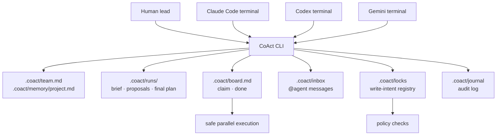

# CoAct

[English](README.md) · **中文**

**给多个编码 agent 共用同一个仓库的终端原生协作层。**

CoAct 让 Claude Code、Codex、Gemini 和其他编码 agent 可以在同一个项目里协作，
不用来回复制上下文，也尽量避免互相覆盖文件。agent 继续使用它们自己的原生
terminal；CoAct 负责共享协调层：团队规则、项目记忆、planning run、任务归属、
inbox 消息、写入意图锁、策略检查和审计日志。

CoAct 不是模型提供方，也不替代 Claude/Codex/Gemini 的 CLI。

## 快速开始

```sh
coact init
coact doctor
coact claude      # terminal 1
coact codex       # terminal 2
```

之后可以从任意 terminal 协调：

```sh
coact @codex "请 review Claude 的 proposal。"
coact @claude "请检查 UX copy。"
coact @all "planning 开始，请读取 run brief。"
coact inbox
```

启动结构化 planning phase：

```sh
coact plan --with codex,claude --distributor codex "安全地实现 auth module"
```

CoAct 会创建 `.coact/runs/<run>/`，要求每个 agent 写 proposal，并让配置好的 final
distributor 写最终方案和创建任务。

## 工作流

### 1. 定义团队规则

`coact init` 会创建 `.coact/team.md`。可以在里面定义：

- 谁是 `final_task_distributor`
- 哪些 agent 参与 planning
- Claude/Codex/Gemini 通常负责什么
- 每个 agent 开始前必须读取什么

本地长期上下文放在 `.coact/memory/project.md`。

### 2. 保留原生 terminal

agent 继续跑在自己的 CLI 里：

```sh
coact claude
coact codex
coact gemini
```

launcher 会设置 `COACT_AGENT`、保持 presence，并在退出时释放本 session 的锁。
它也会设置 `COACT_BIN`，并把当前 CoAct binary 所在目录放到 `PATH` 前面，所以即使用
绝对路径启动，agent 也能运行 `coact inbox`。你也可以手动运行 agent CLI，只要它遵守
仓库里的 contract 文件。

### 3. 一起规划

```sh
coact plan --with codex,claude --distributor codex "重构 CLI"
coact plan status
```

planning 文件位于 `.coact/runs/<run>/`：

- `brief.md`：人类/任务 brief
- `proposals/<agent>.md`：每个 agent 的独立方案
- `notes/<agent>.md`：读取彼此方案后的 second-pass notes
- `final-plan.md`：distributor 的最终执行决策

### 4. 安全并行执行

```sh
coact board
coact task add "Add @agent inbox syntax"
coact claim T-001
coact lock internal/cli
coact done T-001
```

CoAct 会串行化 board 修改，所以两个 agent 不能同时 claim 同一个任务。写入意图锁会减少
重叠编辑。Claude Code 有 L2 hook 硬拦截；Codex 和 Gemini 通过 L1 contract 自律执行。

### 5. 消息和交接

```sh
coact @claude "T-001 完成前请 review 一下。"
coact inbox
coact handoff codex "parser 改完了；测试还需要补。"
```

消息只是本地 filesystem inbox，不是 shell 执行，并且会写入 journal。

## 设计



默认产品形态是 terminal-native。`coact ui` 仍然保留为可选实验功能，但不是主流程必需。

## 命令

| 命令 | 作用 |
|---|---|
| `coact` | 显示 terminal 工作区摘要 |
| `coact init` / `doctor` / `deinit` | 设置、验证或移除 CoAct 接线 |
| `coact claude` / `codex` / `gemini` | 启动受管理的原生 agent session |
| `coact @agent "..."` / `@all "..."` | 发送本地 inbox 消息 |
| `coact plan "..."` / `plan status` | 创建或查看 planning run |
| `coact board` / `task add` / `claim` / `done` | 管理共享任务 |
| `coact status` / `log` | 查看参与者、锁和审计记录 |
| `coact inbox` / `handoff` | 读取消息或转交上下文/任务 |
| `coact lock` / `unlock` / `policy` | 管理写入意图和策略检查 |
| `coact worktree` / `merge` | 用分支隔离 agent，并集成工作 |
| `coact versions` / `update` / `switch` | 管理 `~/.coact` 下的二进制版本 |
| `coact ui` | 可选实验性本地 UI |

完整命令见 `coact help`。

## 安全

- `@agent` 和 inbox 消息只写本地文件，不执行 shell。
- board 修改会被串行化，两个 agent 不能同时 claim 同一个任务。
- 写入意图锁用于避免互相覆盖。
- 运行时/敏感协作状态默认 gitignore：inbox、journal、locks、session、terminal logs、planning runs、本地 memory。
- hook 失败开放：如果 CoAct 出错，不会锁死编辑器。
- `coact update` 是可选功能，使用 HTTPS，并校验 SHA-256。

完整模型见 [SECURITY.md](SECURITY.md)。

## 安装

```sh
go install github.com/tianyi-zhang-02/coact/cmd/coact@latest
```

或本地构建：

```sh
git clone https://github.com/tianyi-zhang-02/coact
cd coact
go build -o coact ./cmd/coact
```

## 许可

MIT —— 见 [LICENSE](LICENSE)。
