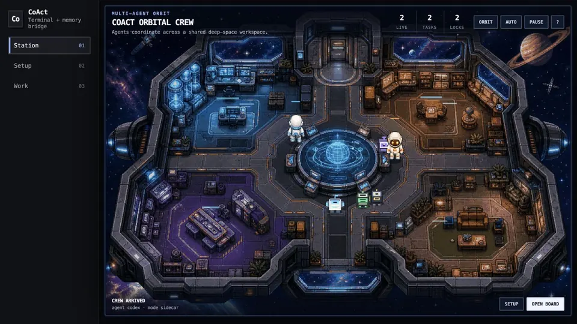

<div align="center">
  
  <h1>CoAct</h1>
  <p><strong>让 Claude Code、Codex 和 Antigravity 在同一个仓库协作，同时保留各自熟悉的原生终端。</strong></p>

  <p>
    <a href="https://github.com/tianyi-zhang-02/coact/releases/latest"></a>
    <a href="https://github.com/tianyi-zhang-02/coact/actions/workflows/ci.yml"></a>
    <a href="https://github.com/tianyi-zhang-02/coact/stargazers"></a>
    <a href="LICENSE"></a>
  </p>
  <p>
    
    
    <a href="README.md"></a>
    <a href="README.zh-CN.md"></a>
  </p>

  <p><a href="README.md">English</a> · <strong>简体中文</strong> · <a href="docs/FEATURES.md">功能状态</a> · <a href="SECURITY.md">安全说明</a></p>
</div>

<p align="center">
  
</p>
<p align="center"><em>两个原生 agent terminal，一套共享规划、任务看板、安全层与审计记录。</em></p>

CoAct 是本地的多 agent 协作与安全层。每个 agent 继续使用原来的 CLI，CoAct 负责补充
共享项目记忆、共同规划、任务归属、直接消息、写入意图锁、用量提醒、合作报告和可审计
journal。

> **CoAct 负责协调，不是新的模型提供方、终端或自主 coding agent。** 每个 agent CLI
> 仍需单独安装并完成登录。

## 为什么使用 CoAct？
| 没有 CoAct | 使用 CoAct |
|---|---|
| 在不同终端间复制 context | 共享项目记忆与 inbox |
| 多个 agent 可能抢同一任务 | 明确的 task、owner、claim 和 lock |
| 决策散落在聊天历史 | 本地 planning files 与 audit journal |
| 很难复盘合作质量 | 用量提醒与带证据标签的合作报告 |
| 必须反复检查每个终端 | 一个状态命令，或可选可视化 Station |

## 快速开始

### 1. 安装

可以从 [最新 Release](https://github.com/tianyi-zhang-02/coact/releases/latest) 下载预编译版本，
也可以使用 Go 1.22+ 安装：

```sh
go install github.com/tianyi-zhang-02/coact/cmd/coact@v1.0.0
```

确认 binary 已加入 `PATH`，然后在项目中初始化一次：

```sh
cd your-project
coact init
coact doctor
```

### 2. 启动你已经在使用的 agent

每个 agent 使用一个原生 terminal。只启动一个 agent 也可以；多个 live agents 位于同一个
已初始化 workspace 时，协作功能会自动生效。

```sh
# terminal 1
coact claude

# terminal 2
coact codex

# 可选 terminal 3 —— 启动原生 `agy` CLI
coact antigravity
```

| 内置 launcher | 原生 CLI | 协作保护方式 |
|---|---|---|
| Claude Code | `claude` | hook 硬拦截冲突路径 |
| OpenAI Codex | `codex` | 注入协作 contract；可使用 worktree |
| Antigravity | `agy` | 注入协作 contract；可使用 worktree |

### 3. 从任意终端协调

你**不需要**额外开启一个管理 terminal：

```sh
coact @all "读取项目 brief，并分别提出方案。"
coact @codex "实现前先 review Claude 的 proposal。"
coact inbox
coact board
coact status
```

launcher 会设置 `COACT_AGENT`、`COACT_BIN` 和 `PATH`，因此即使用 CoAct binary 的
绝对路径启动 agent，它仍然可以直接执行 `coact inbox` 等命令。

`v1.0.0` 是第一个稳定的 terminal-native coordination release。

## 可选可视化 Station <sup>Beta</sup>

运行 `coact ui` 可以打开只绑定 loopback 的本地状态页，查看 live agents、tasks、locks、
messages、planning events 和审计活动。Agent 仍在各自原生 terminal 中工作；Station 不
读取 terminal 输入，也不会替代 CLI。动画可以关闭，handoff 必须由 human 明确确认。
当前限制见 [功能状态](docs/FEATURES.md)。

## 日常工作流

### 1. 设置共享偏好

`coact init` 会创建两个由 human 控制的文件：

- `.coact/team.md`：agent 分工、planning 参与者和最终任务分配者
- `.coact/memory/project.md`：长期项目事实和偏好

不要在这些文件里放密钥或私人数据。

### 2. 一起规划

```sh
coact plan --with codex,claude --lead codex "安全地重构 authentication"
coact plan status
```

每个 agent 会收到本地 inbox 消息，并在 `.coact/runs/<run>/` 下独立写 proposal。
lead 等所有 proposal 都变成 `Status: ready` 且已解锁，再在 `final-plan.md`
写结构化任务。每个任务包含 Dashboard 上显示的短描述，以及真正发给 owner 的完整 Prompt：

```md
## Execution tasks

- [codex] 实现 authentication 改动
  Prompt: 按已批准方案实现，添加聚焦测试，并汇报验证结果。
- [claude] 检查安全性和文档
  Prompt: 检查安全回归并同步更新中英文 README。
- [unassigned] 执行最终 smoke test
```

然后运行：

```sh
coact plan submit --agent codex <run-id>
coact plan approve <run-id>                 # human 安全确认
coact plan finalize --agent codex <run-id>
```

默认必须人工审核：lead submit 后，human approve 之前无法 finalize。只有显式使用
`--approval auto` 才会跳过人工确认；这是危险模式，但仍不会自动唤醒 agent，也不会
替代原生 CLI turn。只有设定好的 lead 可以 finalize。CoAct 会锁住整个 planning run，重新确认
每个必需 proposal 都 ready 且未被锁定，串行更新 board，把 task ID 写回
`final-plan.md`，记录 journal，并通知所有参与者。已分配任务先进入 `claimed`，owner
真正开工时仍需运行 `coact claim <id>`。默认消息是 turn-based：空闲 agent 会在下一次
turn 读取；实验性的 real-time bridge 可以提供 mid-turn push。

proposal 写完后，agent 不需要手动改 metadata：

```sh
coact plan ready <run-id>
```

### 3. 不抢任务、不互相覆盖

```sh
coact board
coact task add --prompt "实现并添加聚焦测试" "加入 rate limiting"
coact task show T-001            # 明确查看本地完整 Prompt
coact task assign T-001 codex  # 先预留，不会显示为已经开工
coact claim T-001
coact lock internal/auth
# 修改和测试
coact unlock internal/auth
coact done T-001
```

任务状态严格按 `todo → claimed → doing → done` 流转。任务必须先由 owner claim 并开工，
之后才能标记完成；开工前可运行 `coact task unassign T-001`，完成后需要返工可运行
`coact task reopen T-001`。本地 UI 使用完全相同的状态机，并提供 Open、All、Done 三种视图。

board 变更会串行化。Claude Code 遇到冲突路径时会被 hook 硬拦截；Codex 和 Antigravity
通过注入的 contract 自律，因此共享目录里的保护属于 advisory。需要更强物理隔离时，
使用 `coact <agent> --worktree`。

### 4. 消息、交接与审计

```sh
coact @claude "请 review T-001。"
coact handoff codex "parser 已完成；integration tests 还没做。"
coact log -n 50
```

消息只会写本地 inbox 文件，不会执行 shell 命令。

## 用量与配额提醒

CoAct 不抓取你的 provider 私有账户。human、adapter 或 agent 可以把已经知道的配额
数据写入 CoAct；系统会立即计算，并默认每 20% 提醒一次：

```sh
coact usage set --agent claude --model "Opus" --percent 42 --refresh-in 7d
coact usage set --agent codex --used 250000 --limit 1000000 --refresh "2026-07-17T00:00:00Z"
coact usage report
coact usage alerts
```

`coact usage report --watch` 会持续刷新本地状态。刷新时间到达前 CoAct 不轮询；到期后
report 会提示录入新 snapshot。跨过阈值时，会写 journal，并通知本地 human/workmate
inbox。

## 合作质量报告

一个 run 结束后，agent 可以互相评分。审计事实和主观评分会明确分开：

```sh
coact eval rate --peer claude --model "Opus" --score 4 \
  --code-quality 5 --responsiveness 3 --note "review 很扎实，但响应偏慢。"
coact eval report run-20260710-120000
```

报告汇总任务完成、消息、锁冲突、merge conflict、观测响应时间、discrepancy 处理和
互评 code quality。`--watch` 可持续刷新。这个报告用于 human 动态调整分工和模型，不是
客观 benchmark。

## 中文表达诊断

默认开启、模型无关的中文表达基础层可检测中文和中英混合文本，保护 code、URL、路径
和表格；校验不通过就回退原文：

```sh
echo '这个 feature 的 goal 是共享 memory，同时运行 `coact inbox`。' | coact zh check --diagnostics
echo '这是一个测试。' | coact zh check --off
```

当前版本提供 detection/protection 诊断和 Go adapter，但不会自动接管 provider
输出，也不会自行调用润色模型。

## 哪些功能可以直接用？

完整审查结果见 [功能状态](docs/FEATURES.md)。简要结论：

- **Ready：**初始化、原生 launcher、共享记忆、planning files、board ownership、
  inbox、locks/policy、audit log、worktrees、本地用量提醒、合作报告和中文诊断。
- **Experimental：**Claude↔Codex real-time bridge、本地 UI、managed updates。
- **尚未包含：**自动唤醒空闲 agent、抓取 provider 私有账户、嵌入式 terminal、自动
  模型切换或 full autopilot。

## 安全模型

- 协作数据位于 `.coact/`；敏感 runtime 数据默认 gitignore。
- agent/run ID 有严格路径校验；状态使用 atomic write，并在并发 mutation 处加锁。
- config、board 内部状态、locks、inbox、journal、terminal logs、usage 和 evaluations
  都禁止 agent 直接改写。
- `coact doctor` 会检查接线，并运行 enforcement self-test。
- hook 失败开放以保证可用性；CoAct 是 guardrail，不是 process sandbox。
- `coact update` 只在用户主动调用时联网，使用 HTTPS + SHA-256；release 尚未签名。

高安全需求请先阅读 [SECURITY.md](SECURITY.md)。

## 命令地图

| 需求 | 命令 |
|---|---|
| 初始化/检查 | `coact init`, `coact doctor`, `coact deinit` |
| 启动 agent | `coact claude`, `coact codex`, `coact antigravity` |
| 一起规划 | `coact plan`, `coact plan ready`, `coact plan submit/approve/status/finalize` |
| 管理任务 | `coact board`, `task add/show/assign/unassign/reopen`, `claim`, `done` |
| 协作沟通 | `coact @agent`, `@all`, `inbox`, `handoff` |
| 防止覆盖 | `coact lock`, `unlock`, `policy`, `worktree`, `merge` |
| 查看状态 | `coact`, `status`, `log` |
| 配额提醒 | `coact usage set`, `report`, `alerts` |
| 合作复盘 | `coact eval rate`, `report` |
| 中文诊断 | `coact zh check` |
| 版本管理 | `coact versions`, `update`, `switch` |

完整参数见 `coact help`。`coact ui`、`channel` 和 `bridge` 保留为可选实验功能。

## 从源码安装

```sh
git clone https://github.com/tianyi-zhang-02/coact
cd coact
go build -o coact ./cmd/coact
```

## 参与贡献

欢迎 Fork、提交 bug、范围明确的 PR、新 agent adapter 和文档改进。请先阅读
[CONTRIBUTING.md](CONTRIBUTING.md)，了解本地测试、安全要求和 review 流程。安全漏洞请
按照 [SECURITY.md](SECURITY.md) 通过 private advisory 提交，不要公开开 Issue。

MIT —— 见 [LICENSE](LICENSE)。
