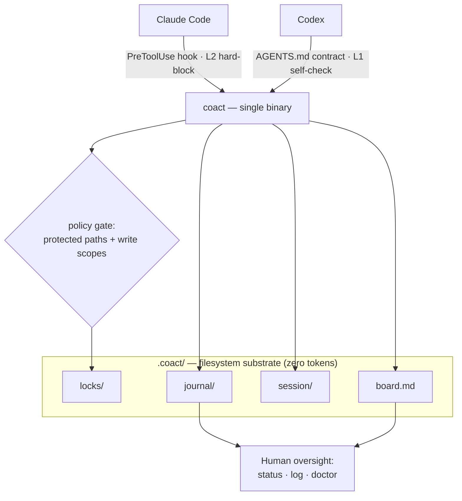

# CoAct

[English](README.md) · **中文**

**让多个编码 agent 在同一个仓库里协同工作。**

我整天都在同一个项目上、在 Claude Code 和 Codex 之间反复横跳,因为它俩是互补的。
Claude Code 更擅长系统设计,整体交互也更自然(当然它也是更有"脾气"的那个);Codex
执行得扎实,只是用起来有点呆。所以我常常用一个来规划和梳理、用另一个来把活干出来
——都在同一批文件上。手动这么搞就得在两边复制粘贴、还得盯着谁能动哪些文件;而当其中
一个用满了套餐额度,我又想把任务直接交给另一个。CoAct 就是为此而生的协同层:它现在
解决了复制粘贴和互相踩踏,并正朝着"跨套餐交接"演进。

CoAct 把一个工作目录变成一个受协调、可审计的工作区,让两个或更多 agent(比如
Claude Code 和 Codex)在同一份文件上工作而互不破坏。它是一个独立的静态二进制
(Go 编写,零运行时依赖)。

让两个 agent 互相说话是简单的部分。CoAct 要解决的是底下更难的问题:让并发的 agent
在同一批文件上跑得**安全、可控、低成本**。

## 为什么

多个 agent 在同一个目录里工作会带来三个问题,CoAct 正是围绕它们设计的:

- **安全** —— 写入是被限定和拦截的:当另一个 agent 正持有某个文件时,这个 agent
  的编辑会被拦下(对 Claude Code 通过 hook 强制执行),策略禁止时也会被拦下——
  受保护路径需要人来把关,每个 agent 还能被限定在自己的写入范围内。所有动作都写进
  只追加的 journal,因此一个出错或被注入的 agent 是被隔离且可追溯的,而不是已经
  改动了你的文件。(想要更强的隔离,见下面的 worktree 模式。)
- **可控** —— 计划是一块你自己拥有并编辑的任务板,而不是 agent 之间自发的聊天。
  所有状态都是纯文本、可直接查看的文件。
- **低成本** —— 协调发生在文件系统里(锁、任务板、journal——零 token),而不是在
  agent 的上下文窗口里。并发和实时消息是可选的,而不是默认常开。

agent 之间的实时消息(交叉评审、任务交接)是**顶层的一个可选平面**——任何跨过去的
消息都会经过策略校验并被记入 journal,永远不会绕过治理核心。

## 快速开始

先安装 CoAct(见下文),然后在你的仓库里:

```sh
coact init        # 接入 Claude Code 的 hook,并写入 agent 契约
coact doctor      # 验证:检查接线,并对强制执行做自检
```

`coact doctor` 会在**不需要第二个 agent** 的情况下确认 CoAct 在你机器上能正常
工作——它会放置一个锁,验证 gate 会拦下冲突、放行空闲路径、并对受保护路径把关。

然后在各自的终端里启动每个 agent,一条命令搞定:

```sh
coact claude      # 终端 1 —— Claude Code,会话由 coact 托管
coact codex       # 终端 2 —— Codex
```

`coact claude` 会设置身份、在 agent 运行期间保持在线状态,并在退出时释放这次会话
持有的锁——不用管理后台进程。(你也可以手动来:
`export COACT_AGENT=claude; coact sidecar &; claude`。)

CoAct 只是加了一道 gate;它**不需要** `--dangerously-skip-permissions`,而且 hook
是**失败开放**的——万一 CoAct 出错,你照样能编辑。任何时候都能用 `coact deinit`
移除全部接线。

在共享任务板上分工:

```sh
coact task add "Build auth module"
coact task add "Build API gateway"
coact claim T-002     # claude 领走 auth
coact claim T-003     # codex 领走 gateway
```

现在它们并行工作。如果一个跑去动另一个正持有的文件,CoAct 会拦住它——对 Claude
来说,hook 会直接拦下这次编辑:

```
coact: src/gateway/router.go is locked by "codex" since 2026-07-06T21:09:32Z.
Another agent is working there — coordinate via `coact status`.
```

随时查看:

```sh
coact status      # 在线的 agent、它们当前的任务、以及被持有的锁
coact log         # 完整的审计记录
```

### 隔离(worktree 模式)

默认两个 agent 共享同一份工作树,通过锁来协调。想要更强的隔离,就给每个 agent 各自
一个 git worktree 和分支:

```sh
coact claude --worktree     # Claude 在 coact/claude 分支上隔离工作
coact codex  --worktree     # Codex 在 coact/codex 分支上
coact merge claude codex    # 集成——遇到冲突会停下来并把冲突列给你看
```

任务板和 journal 在各 worktree 之间保持共享;因为在不同分支上,编辑不会互相踩踏,
冲突留到合并时由你来解决。

## 命令

| 命令 | 作用 |
|---|---|
| `coact init` | 在本仓库接入 hook 和契约 |
| `coact doctor` | 检查配置并自检强制执行(不需要 agent) |
| `coact deinit` | 移除 CoAct 的接线(`--purge` 连 `.coact/` 一起删) |
| `coact claude` / `coact codex` | 启动一个 agent(加 `--worktree` 隔离) |
| `coact worktree add/list/rm` | 每个 agent 独立的 git worktree |
| `coact merge <agent>` | 合并某个 agent 的分支(遇冲突即停) |
| `coact status` | 在线参与者、当前任务、活动的锁 |
| `coact log` | 最近的 journal 事件(监督视图) |
| `coact board` | 列出任务和归属 |
| `coact task add "<t>"` | 往任务板加一个任务 |
| `coact claim <id>` / `done <id>` | 领取 / 完成一个任务 |
| `coact lock <path>` / `unlock <path>` | 写入意图锁(`unlock --all` 释放你所有的锁) |
| `coact policy check <path>` / `show` | 测试或查看写入策略 |
| `coact sidecar` | 单会话的在线心跳 |

只有当一个参与者**既**超过了 TTL、**又**在 presence 上判定为不在线时,它的锁才会
被抢走——所以一次长时间的构建或长时间的推理都不会丢掉自己的锁。

## 架构



协调发生在文件系统里(零 token);强制执行按 agent 区分——Claude 通过 hook 硬
拦截,Codex 通过契约自律。完整细节见 [docs/ARCHITECTURE.md](docs/ARCHITECTURE.md)。

## 现状

现在可用:两个 agent(Claude Code + Codex)的协同、带 Claude Code hook 强制执行的
写入意图锁、能力策略(受保护路径 + 每个 agent 的写入范围)、任务板、presence、
journal,以及可选的带合并闸门的 git worktree 隔离——全部装在一个跨平台的二进制里。
路线图上:更多 agent 适配器、以及可选的消息平面。见
[docs/ARCHITECTURE.md](docs/ARCHITECTURE.md)、[docs/ROADMAP.md](docs/ROADMAP.md)、
[docs/SPEC.md](docs/SPEC.md)、[docs/STACK.md](docs/STACK.md)。

## 安装

预编译的独立二进制,无需运行时(macOS、Linux、Windows):

```sh
# 从源码(需要 Go 1.22+)
go install github.com/tianyi-zhang-02/coact/cmd/coact@latest

# 或本地构建
git clone https://github.com/tianyi-zhang-02/coact && cd coact
go build -o coact ./cmd/coact
```

发布二进制和一行安装脚本会随第一个正式 tag 一起提供。

## 平台

`darwin`、`linux`、`windows` —— `amd64` 和 `arm64`。协调原语只用可移植的文件系统
操作(原子创建、原子重命名);少数与操作系统相关的部分(进程存活检测)通过构建
标签隔离在 `internal/platform` 里。

## 排障

- **先跑 `coact doctor`。** 它能定位大多数问题,并对引擎做自检。
- **某次编辑没被拦下。** Claude Code 在启动时读取 `.claude/settings.json`——所以
  `coact init` 之后要重启它。用 `coact doctor` 确认 hook 已接好。注意强制执行是
  Claude 这一侧的;Codex 是 L1(通过 `AGENTS.md` 自律)。
- **hook 报 "coact: command not found",或二进制被移动了。** hook 里存的是二进制
  的绝对路径。如果你移动或重装了 CoAct,重新跑一次 `coact init`。
- **某个 agent 卡住了,被拦在本该属于它的文件上。** 一次会话里,agent 会在它编辑
  过的文件上累积锁。用 `coact unlock --all` 释放(`coact claude`/`coact codex`
  启动器在退出时会自动做这件事)。
- **实时查看。** `coact status --watch`。
- **全部移除。** `coact deinit`(加 `--purge` 连 `.coact/` 一起删)。

## 安全

CoAct 会接入一个在每次编辑时都运行的 hook,因此它很在意自身的安全:不执行 shell、
不联网、写入被限定在仓库内、agent 标识会被净化、hook **失败开放**,而且一切都能用
`coact deinit` 移除。完整的安全模型见 [SECURITY.md](SECURITY.md)。

## 许可

MIT —— 见 [LICENSE](LICENSE)。
