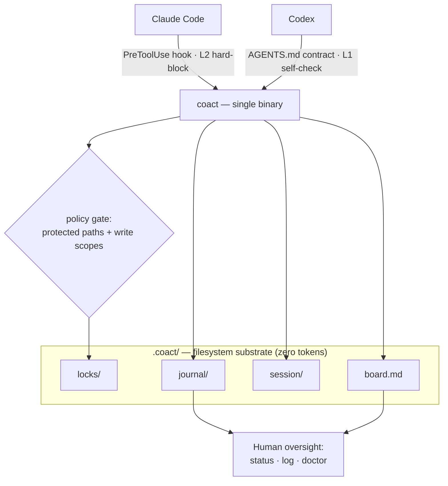
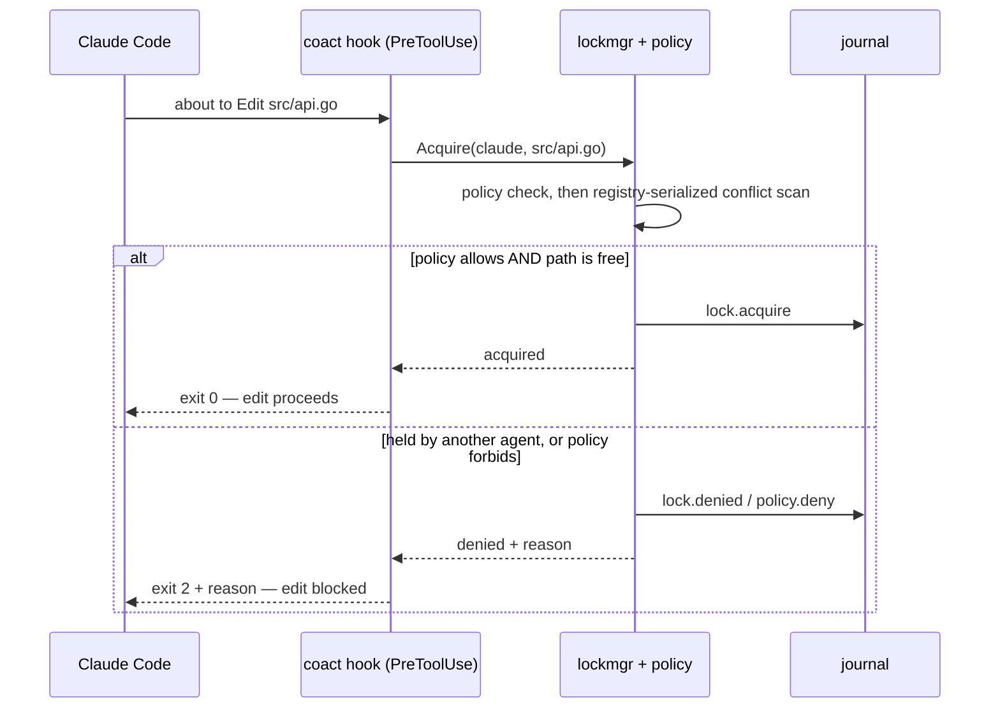
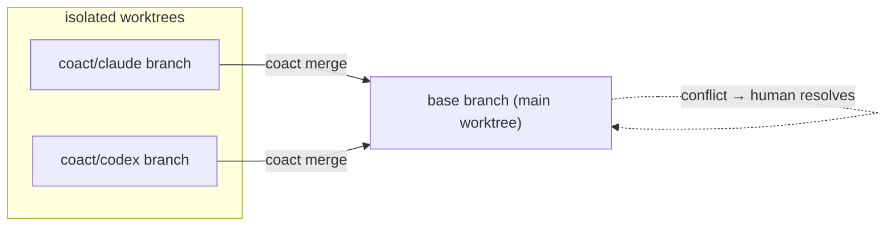

# Architecture

coact is a single Go binary that turns a working directory into a governed,
auditable workspace two or more coding agents can share. Coordination lives in
the filesystem under `.coact/` (zero tokens); enforcement is delivered per agent
through an adapter. This document is the map — the wire-level protocol is in
[SPEC.md](SPEC.md).

## Overview

Enforcement is **asymmetric by design**: Claude Code exposes a `PreToolUse`
hook, so its edits are hard-blocked (L2); Codex has no pre-write hook, so it
self-enforces from the contract in `AGENTS.md` (L1). A pool is only as safe as
its weakest *live* participant — which is why isolation (worktree mode, on the
roadmap) matters more as lower-tier agents join.

## The enforcement flow

Every gated edit passes through the same decision — whether it comes from the
hook, `coact lock`, or the `coact doctor` self-test:

The hook **fails open**: on any error, or in a repo without coact, it returns
exit 0 — a coact problem never blocks your editing.

## Isolation: worktree mode

Shared mode (above) coordinates edits on one working tree with advisory locks. In
**worktree mode**, each agent works in its own `git worktree` on branch
`coact/<agent>`. The *bytes* are branch-isolated — edits never physically collide
— while coact still coordinates by **logical path**: a lock is taken relative to
the agent's worktree checkout and recorded in the *shared* registry, so two
agents can't both claim the same file even from different worktrees. Divergent
changes to the same file are then reconciled at integration time by `coact
merge`, which **stops on conflict** for a human to resolve — the merge gate.

`.coact/` stays shared: coact detects a linked worktree via git's
`--absolute-git-dir`, resolves shared state (board, journal, presence, the lock
registry) to the main worktree, and interprets file paths relative to whichever
worktree checkout you are in.

## Messaging & hand-off (turn-based)

Agents communicate through `.coact/inbox/<agent>.md` — `coact msg` appends,
`coact inbox` reads and consumes, serialized under a metalock and journaled.
Delivery is **turn-based** (an agent reads its inbox at the start of a turn), not
real-time push. `coact handoff` reassigns the sender's active board tasks to
another agent, releases its locks, and messages the recipient with context — the
explicit "I'm stopping / hitting my plan limit, take over" move. Real-time
mid-turn push and automatic quota-triggered hand-off remain on the roadmap.

## Components

| Package | Responsibility |
|---|---|
| `cmd/coact` | entry point |
| `internal/cli` | commands, the Claude `PreToolUse` hook, and the agent launchers |
| `internal/lockmgr` | advisory write-intent locks, registry-serialized; presence-gated stealing |
| `internal/metalock` | crash-safe `O_EXCL` mutual exclusion (lock registry, board writes) |
| `internal/policy` | capability engine — protected paths + per-agent write scopes |
| `internal/board` | the shared task board (`claim` / `done` / `add`) |
| `internal/presence` | per-session heartbeat; the liveness authority for lock stealing |
| `internal/journal` | append-only JSONL audit log |
| `internal/inbox` | turn-based agent-to-agent messages (`msg`/`inbox`/`handoff`) |
| `internal/config` | `.coact/config.json` |
| `internal/project` | locating `.coact/` and resolving its paths |
| `internal/platform` | atomic writes + build-tagged process-liveness (macOS/Linux/Windows) |

## Three properties, three mechanisms

- **Security** — the policy engine gates writes (protected paths need a human;
  agents can be scoped to globs), locks prevent collisions, and the journal makes
  every action attributable. The hook is the hard enforcement point for Claude.
- **Controllability** — the plan is the `board.md` you own and edit; all state is
  plain inspectable files; `coact deinit` cleanly backs everything out.
- **Cost** — coordination is filesystem I/O, not tokens; concurrency and the
  (future) messaging plane are opt-in, not the always-on baseline.

See [SPEC.md](SPEC.md) for file formats and state machines, and
[ROADMAP.md](ROADMAP.md) for what is built versus planned.
